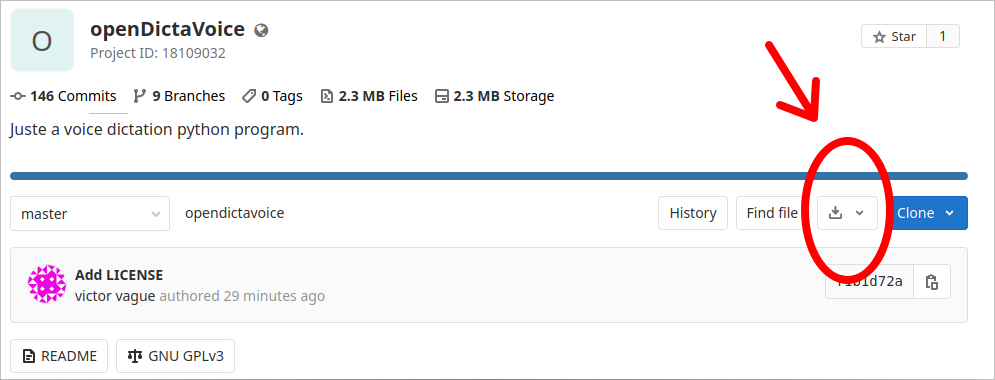

# OpenDictaVoice

## I) Description:

A voice dictation program written in **python3** to do voice dictation.

## II) Installation:

### Step 1: Download the program

Run the shell command:
```bash
git clone https://gitlab.com/Sleb/opendictavoice.git
```

Or, download the repository directly from gitlab


### step 2: Install dependencies


#### Firstly:
If you are using **Linux or MacOS**, it is necessary to install **portaudio** so that Python will be able to use the microphone once you allow it.

On **linux**, to install portaudio, run the shell command:
```bash
sudo apt-get install portaudio
```

On **MacOS**, to install portaudio, run the shell command:
```bash
brew install portaudio
```


#### Secondly:
if you are using **Linux**, it is necessary to install **tkinter for python3** (which is installed by default on Windows and MacOs).
To install it, run the shell command:
```bash
sudo apt-get install python3-tk
```


#### Thirdly:
OpenDictaVoice need the following modules installed to work (SpeechRecognition, pyaudio, pynput, python-xlib, six)

**You can install all dependancies automatically** by running, in the downloaded directory, the command:
```bash
pip install -r ./dependancies.txt
```

**But if you prefer to do it manually**, just follow steps bellow:

1) The OpenDictaVoice program uses **SpeechRecognotion** module to work, wich is available here:
[https://pypi.org/project/SpeechRecognition/](https://pypi.org/project/SpeechRecognition/)

To install it, run the shell command:
```bash
pip install SpeechRecognition
```

2) **PyAudio:** To install it, run the shell command:
```bash
pip install pyaudio
```

3) **pynput:** To install it, run the shell command:
```bash
pip install pynput
```

4) **python-xlib:** To install it, run the shell command:

```bash
pip install python-xlib
```

5) **six:** To install it, run the shell command:
```bash
pip install six
```

## III) How to use:

### Launch:

Go to the the dowloaded directory, then run the shell command:
```bash
python3 ./opendictavoice_app/opendictavoice_main.py
```

Or, launch the program by clicking on the opendictavoice_main.py file in your favorite file browser

### Utilisation: 


It will open a window with low opacity that is always in the foreground.
Then, put the focus on the element you want to write in (notepad or gedit for example), and when you want to speak, hold **CTRL + SHIFT** keys to launch the record.
When you release the CTRL + SHIFT keys, it will analyse the recorded sound and write the text.
