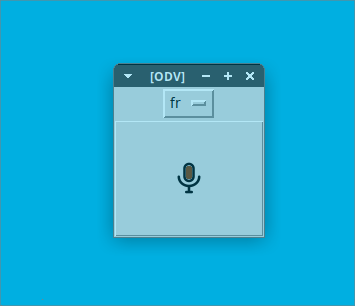
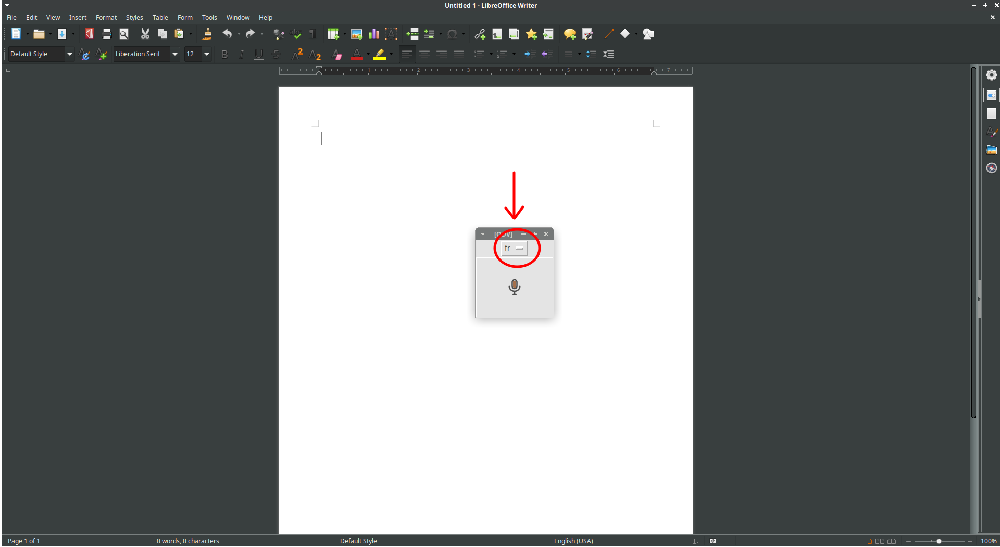
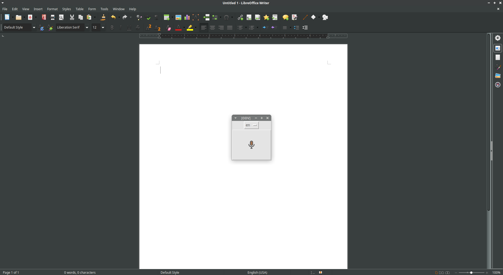
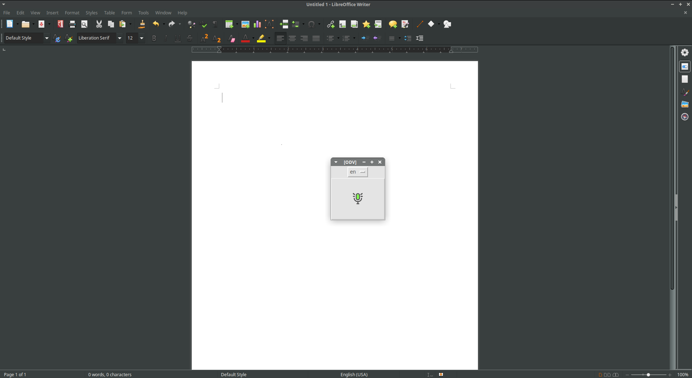
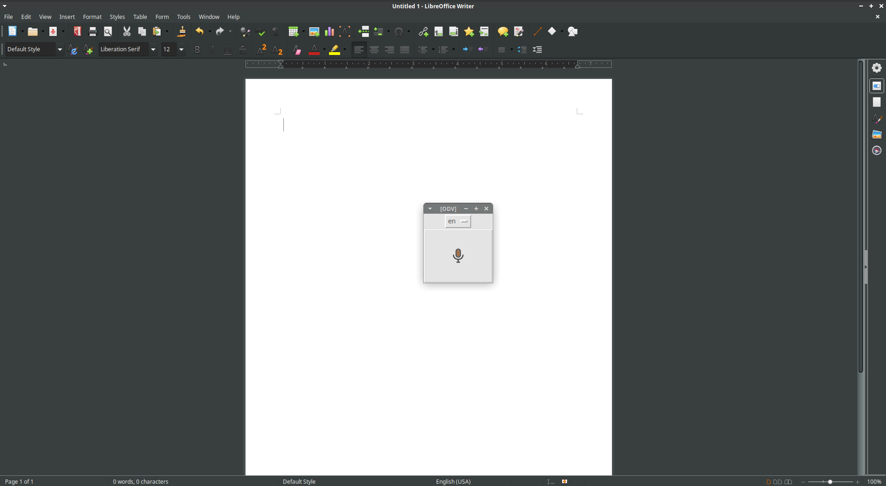

# OpenDictaVoice

## I) Description:

A voice dictation program written in **python3** to do voice dictation.

## II) Installation:

### Step 1: Download the program

Run the shell command:
```bash
git clone https://gitlab.com/Sleb/opendictavoice.git
```
&nbsp;  
**Or**, if you prefer, download the repository directly from gitlab


### step 2: Install dependencies


#### Firstly:
If you are using **Linux or MacOS**, it is necessary to install **portaudio** so that Python will be able to use the microphone once you allow it.

On **linux**, to install portaudio, run the shell command:
```bash
sudo apt-get install portaudio
```

On **MacOS**, to install portaudio, run the shell command:
```bash
brew install portaudio
```


#### Secondly:
if you are using **Linux**, it is necessary to install **tkinter for python3** (which is installed by default on Windows and MacOs).
To install it, run the shell command:
```bash
sudo apt-get install python3-tk
```


#### Finally:
OpenDictaVoice need the following modules installed to work (SpeechRecognition, pyaudio, pynput, python-xlib, six)

**You can install all dependancies automatically** by running, in the downloaded directory, the command:
```bash
pip install -r ./dependancies.txt
```

**But if you prefer to do it manually**, just follow steps bellow:

1) The OpenDictaVoice program uses **SpeechRecognotion** module to work, wich is available here:
[https://pypi.org/project/SpeechRecognition/](https://pypi.org/project/SpeechRecognition/)

To install it, run the shell command:
```bash
pip install SpeechRecognition
```

2) **PyAudio:** To install it, run the shell command:
```bash
pip install pyaudio
```

3) **pynput:** To install it, run the shell command:
```bash
pip install pynput
```

4) **python-xlib:** To install it, run the shell command:

```bash
pip install python-xlib
```

5) **six:** To install it, run the shell command:
```bash
pip install six
```

## III) How to use:

### Launch:

Go to the the dowloaded directory, then run the shell command:
```bash
python3 ./opendictavoice_app/opendictavoice_main.py
```

**Or**, launch the program by clicking on the opendictavoice_main.py file in your favorite file browser

Note: you can of course make a shortcut to the ```./opendictavoice_app/opendictavoice_main.py``` file to launch it easily.

### Utilization: 


It will open a window with low opacity that is always in the foreground.



By default the recognized language is in french. If you want to change it for the english you can do it with the scrolling menu.




Then, put the focus on the element you want to write in (libreoffice writer here in the example),



and when you want to speak, hold **CTRL + SHIFT** keys to launch the record.



When you release the CTRL + SHIFT keys, it will stop the record, analyse the recorded sound and then write the text where the focus is.




**Note**: if you don't want to use the **CTRL + SHIFT** hotkeys, you can click on the microphone button of the program to launch the record, and click again on it to stop the record.
This will then switch the focus using an ALT + TAB shortcut to get the focus on the element you wanted to write at first.

**Note 2**: You can start a new recording before the analysis of the first one is finished. Each recording is managed by a queue so that the recognized texts will always be written
in the order in which they were recorded. It is usefull to play for time.


## IV) To go further:

OpenDictaVoice is just a graphical interface to do voice dictation using a Speech To Text Engine. For now it uses "Google STT" or "CMU Sphinx" but if you have your own Speech To Text Engine 
(Created with Common Voice and DeepSpeech for example, [https://research.mozilla.org/machine-learning/][https://research.mozilla.org/machine-learning/]), you can use it with this program by modifying the source code.